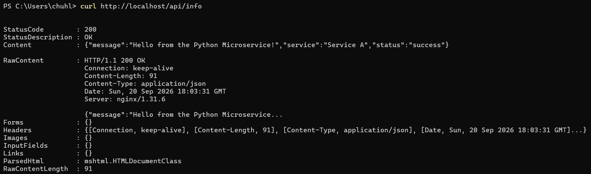
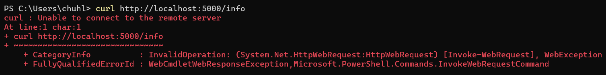

# API Gateway + Microservice Architecture

Цей проєкт демонструє реалізацію мікросервісного патерну **API Gateway** за допомогою Docker. Усі зовнішні HTTP-запити приймає єдина точка входу (Nginx), яка проксіює їх до захищеного внутрішнього мікросервісу (Python/Flask), недоступного безпосередньо ззовні.

---

## Демонстрація роботи та безпеки

### 1. Успішне звернення через API Gateway
Запит надсилається на **порт 80** (Nginx), який успішно перенаправляє його до внутрішнього мікросервісу:
```bash
curl http://localhost/api/info
```



### 2. Блокування прямого доступу до мікросервісу
Спроба звернутися напряму до service_a на порт 5000 повертає помилку (Connection refused), оскільки сервіс працює виключно у внутрішній мережі Docker і не має відкритих назовні порті
```bash
curl http://localhost5000/info
```


---

## Технологічний стек
* **API Gateway:** Nginx (Alpine)
* **Microservice (Service A):** Python 3.11, Flask
* **Orchestration & Networking:** Docker, Docker Compose (Bridge Network)

## Структура проєкту
```text
api-gateway-demo/
├── docker-compose.yml       # Опис сервісів та налаштування мережі
├── gateway/
│   ├── Dockerfile           # Образ для Nginx
│   └── nginx.conf           # Правила маршрутизації (зворотний проксі)
├── service_a/
│   ├── Dockerfile           # Образ для Python-сервісу
│   ├── app.py               # Код мікросервісу (ендпоінт /info)
│   └── requirements.txt     # Залежності Flask
└── assets/
    ├── demo.png             # Скріншот успішного запиту
    └── demo2.png            # Скріншот помилки прямого доступу
```

